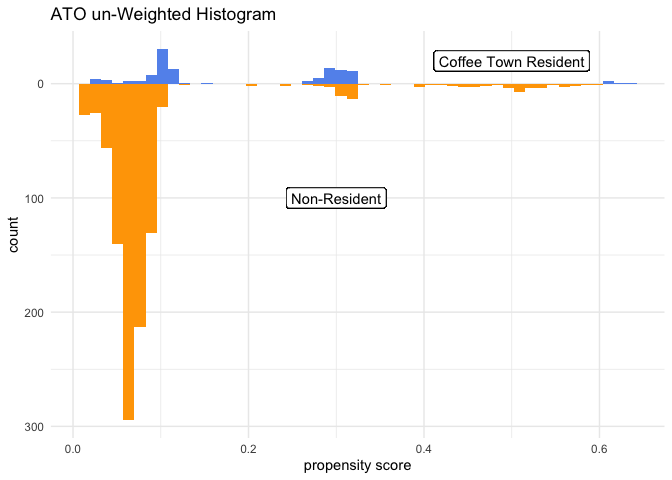
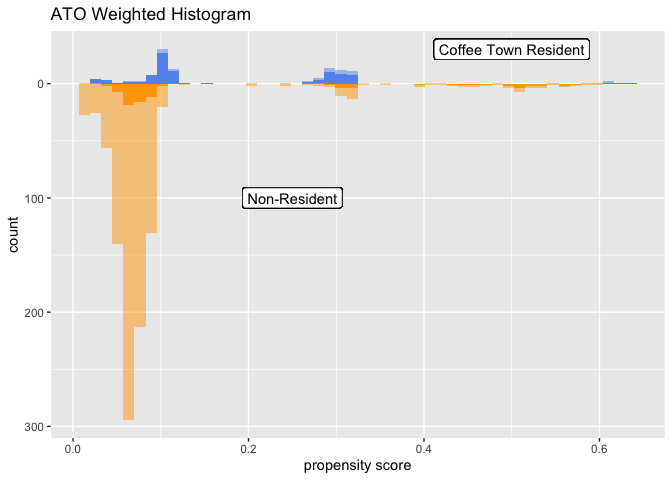
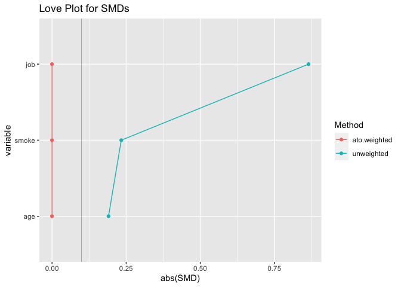
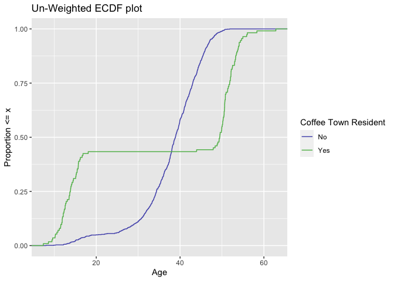
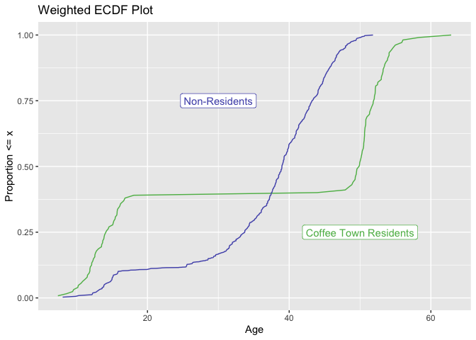
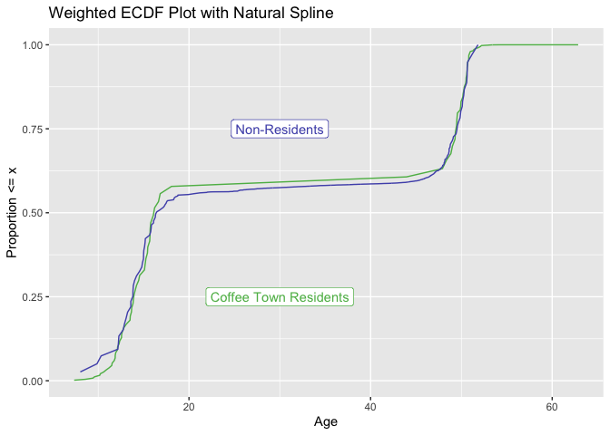

Lab 03 - Using Propensity Scores
================
Kate Boyer
2022-03-29

``` r
library(tidyverse)
library(smd)
```

## Exercise 1

``` r
coffeetown <- read_csv("coffee_town_df.csv")
summary(coffeetown)
```

    ##   coffee_town     cups_of_coffee       age             job           
    ##  Min.   :0.0000   Min.   :0.000   Min.   : 7.356   Length:1100       
    ##  1st Qu.:0.0000   1st Qu.:2.000   1st Qu.:34.003   Class :character  
    ##  Median :0.0000   Median :2.000   Median :38.976   Mode  :character  
    ##  Mean   :0.1027   Mean   :2.229   Mean   :37.538                     
    ##  3rd Qu.:0.0000   3rd Qu.:3.000   3rd Qu.:43.778                     
    ##  Max.   :1.0000   Max.   :6.000   Max.   :62.862                     
    ##     smoke          
    ##  Length:1100       
    ##  Class :character  
    ##  Mode  :character  
    ##                    
    ##                    
    ## 

``` r
head(coffeetown)
```

    ## # A tibble: 6 × 5
    ##   coffee_town cups_of_coffee   age job   smoke
    ##         <dbl>          <dbl> <dbl> <chr> <chr>
    ## 1           1              0  12.1 none  never
    ## 2           0              0  14.6 none  never
    ## 3           1              0  11.5 none  never
    ## 4           0              1  18.8 easy  never
    ## 5           0              0  15.0 none  never
    ## 6           1              0  11.5 none  never

This data set contains 5 variables:coffee\_town(Y/N),
cups\_of\_coffee(0-6), age, job(none, easy, hard), and smoke(Y/N) and
1100 observations. There are 1100 observations total, 113 are in the
exposure group (live in coffee town) and 987 in the control group. There
is no missing data.

## Exercise 2

``` r
library(gtsummary)
coffeetown %>%
  tbl_summary(
    by = coffee_town, 
    include = c(
      "cups_of_coffee", 
      "age", 
      "job",
      "smoke")) %>%
  add_overall()
```

<div id="nvhljunwta" style="overflow-x:auto;overflow-y:auto;width:auto;height:auto;">
<style>html {
  font-family: -apple-system, BlinkMacSystemFont, 'Segoe UI', Roboto, Oxygen, Ubuntu, Cantarell, 'Helvetica Neue', 'Fira Sans', 'Droid Sans', Arial, sans-serif;
}

#nvhljunwta .gt_table {
  display: table;
  border-collapse: collapse;
  margin-left: auto;
  margin-right: auto;
  color: #333333;
  font-size: 16px;
  font-weight: normal;
  font-style: normal;
  background-color: #FFFFFF;
  width: auto;
  border-top-style: solid;
  border-top-width: 2px;
  border-top-color: #A8A8A8;
  border-right-style: none;
  border-right-width: 2px;
  border-right-color: #D3D3D3;
  border-bottom-style: solid;
  border-bottom-width: 2px;
  border-bottom-color: #A8A8A8;
  border-left-style: none;
  border-left-width: 2px;
  border-left-color: #D3D3D3;
}

#nvhljunwta .gt_heading {
  background-color: #FFFFFF;
  text-align: center;
  border-bottom-color: #FFFFFF;
  border-left-style: none;
  border-left-width: 1px;
  border-left-color: #D3D3D3;
  border-right-style: none;
  border-right-width: 1px;
  border-right-color: #D3D3D3;
}

#nvhljunwta .gt_title {
  color: #333333;
  font-size: 125%;
  font-weight: initial;
  padding-top: 4px;
  padding-bottom: 4px;
  padding-left: 5px;
  padding-right: 5px;
  border-bottom-color: #FFFFFF;
  border-bottom-width: 0;
}

#nvhljunwta .gt_subtitle {
  color: #333333;
  font-size: 85%;
  font-weight: initial;
  padding-top: 0;
  padding-bottom: 6px;
  padding-left: 5px;
  padding-right: 5px;
  border-top-color: #FFFFFF;
  border-top-width: 0;
}

#nvhljunwta .gt_bottom_border {
  border-bottom-style: solid;
  border-bottom-width: 2px;
  border-bottom-color: #D3D3D3;
}

#nvhljunwta .gt_col_headings {
  border-top-style: solid;
  border-top-width: 2px;
  border-top-color: #D3D3D3;
  border-bottom-style: solid;
  border-bottom-width: 2px;
  border-bottom-color: #D3D3D3;
  border-left-style: none;
  border-left-width: 1px;
  border-left-color: #D3D3D3;
  border-right-style: none;
  border-right-width: 1px;
  border-right-color: #D3D3D3;
}

#nvhljunwta .gt_col_heading {
  color: #333333;
  background-color: #FFFFFF;
  font-size: 100%;
  font-weight: normal;
  text-transform: inherit;
  border-left-style: none;
  border-left-width: 1px;
  border-left-color: #D3D3D3;
  border-right-style: none;
  border-right-width: 1px;
  border-right-color: #D3D3D3;
  vertical-align: bottom;
  padding-top: 5px;
  padding-bottom: 6px;
  padding-left: 5px;
  padding-right: 5px;
  overflow-x: hidden;
}

#nvhljunwta .gt_column_spanner_outer {
  color: #333333;
  background-color: #FFFFFF;
  font-size: 100%;
  font-weight: normal;
  text-transform: inherit;
  padding-top: 0;
  padding-bottom: 0;
  padding-left: 4px;
  padding-right: 4px;
}

#nvhljunwta .gt_column_spanner_outer:first-child {
  padding-left: 0;
}

#nvhljunwta .gt_column_spanner_outer:last-child {
  padding-right: 0;
}

#nvhljunwta .gt_column_spanner {
  border-bottom-style: solid;
  border-bottom-width: 2px;
  border-bottom-color: #D3D3D3;
  vertical-align: bottom;
  padding-top: 5px;
  padding-bottom: 5px;
  overflow-x: hidden;
  display: inline-block;
  width: 100%;
}

#nvhljunwta .gt_group_heading {
  padding-top: 8px;
  padding-bottom: 8px;
  padding-left: 5px;
  padding-right: 5px;
  color: #333333;
  background-color: #FFFFFF;
  font-size: 100%;
  font-weight: initial;
  text-transform: inherit;
  border-top-style: solid;
  border-top-width: 2px;
  border-top-color: #D3D3D3;
  border-bottom-style: solid;
  border-bottom-width: 2px;
  border-bottom-color: #D3D3D3;
  border-left-style: none;
  border-left-width: 1px;
  border-left-color: #D3D3D3;
  border-right-style: none;
  border-right-width: 1px;
  border-right-color: #D3D3D3;
  vertical-align: middle;
}

#nvhljunwta .gt_empty_group_heading {
  padding: 0.5px;
  color: #333333;
  background-color: #FFFFFF;
  font-size: 100%;
  font-weight: initial;
  border-top-style: solid;
  border-top-width: 2px;
  border-top-color: #D3D3D3;
  border-bottom-style: solid;
  border-bottom-width: 2px;
  border-bottom-color: #D3D3D3;
  vertical-align: middle;
}

#nvhljunwta .gt_from_md > :first-child {
  margin-top: 0;
}

#nvhljunwta .gt_from_md > :last-child {
  margin-bottom: 0;
}

#nvhljunwta .gt_row {
  padding-top: 8px;
  padding-bottom: 8px;
  padding-left: 5px;
  padding-right: 5px;
  margin: 10px;
  border-top-style: solid;
  border-top-width: 1px;
  border-top-color: #D3D3D3;
  border-left-style: none;
  border-left-width: 1px;
  border-left-color: #D3D3D3;
  border-right-style: none;
  border-right-width: 1px;
  border-right-color: #D3D3D3;
  vertical-align: middle;
  overflow-x: hidden;
}

#nvhljunwta .gt_stub {
  color: #333333;
  background-color: #FFFFFF;
  font-size: 100%;
  font-weight: initial;
  text-transform: inherit;
  border-right-style: solid;
  border-right-width: 2px;
  border-right-color: #D3D3D3;
  padding-left: 5px;
  padding-right: 5px;
}

#nvhljunwta .gt_stub_row_group {
  color: #333333;
  background-color: #FFFFFF;
  font-size: 100%;
  font-weight: initial;
  text-transform: inherit;
  border-right-style: solid;
  border-right-width: 2px;
  border-right-color: #D3D3D3;
  padding-left: 5px;
  padding-right: 5px;
  vertical-align: top;
}

#nvhljunwta .gt_row_group_first td {
  border-top-width: 2px;
}

#nvhljunwta .gt_summary_row {
  color: #333333;
  background-color: #FFFFFF;
  text-transform: inherit;
  padding-top: 8px;
  padding-bottom: 8px;
  padding-left: 5px;
  padding-right: 5px;
}

#nvhljunwta .gt_first_summary_row {
  border-top-style: solid;
  border-top-color: #D3D3D3;
}

#nvhljunwta .gt_first_summary_row.thick {
  border-top-width: 2px;
}

#nvhljunwta .gt_last_summary_row {
  padding-top: 8px;
  padding-bottom: 8px;
  padding-left: 5px;
  padding-right: 5px;
  border-bottom-style: solid;
  border-bottom-width: 2px;
  border-bottom-color: #D3D3D3;
}

#nvhljunwta .gt_grand_summary_row {
  color: #333333;
  background-color: #FFFFFF;
  text-transform: inherit;
  padding-top: 8px;
  padding-bottom: 8px;
  padding-left: 5px;
  padding-right: 5px;
}

#nvhljunwta .gt_first_grand_summary_row {
  padding-top: 8px;
  padding-bottom: 8px;
  padding-left: 5px;
  padding-right: 5px;
  border-top-style: double;
  border-top-width: 6px;
  border-top-color: #D3D3D3;
}

#nvhljunwta .gt_striped {
  background-color: rgba(128, 128, 128, 0.05);
}

#nvhljunwta .gt_table_body {
  border-top-style: solid;
  border-top-width: 2px;
  border-top-color: #D3D3D3;
  border-bottom-style: solid;
  border-bottom-width: 2px;
  border-bottom-color: #D3D3D3;
}

#nvhljunwta .gt_footnotes {
  color: #333333;
  background-color: #FFFFFF;
  border-bottom-style: none;
  border-bottom-width: 2px;
  border-bottom-color: #D3D3D3;
  border-left-style: none;
  border-left-width: 2px;
  border-left-color: #D3D3D3;
  border-right-style: none;
  border-right-width: 2px;
  border-right-color: #D3D3D3;
}

#nvhljunwta .gt_footnote {
  margin: 0px;
  font-size: 90%;
  padding-left: 4px;
  padding-right: 4px;
  padding-left: 5px;
  padding-right: 5px;
}

#nvhljunwta .gt_sourcenotes {
  color: #333333;
  background-color: #FFFFFF;
  border-bottom-style: none;
  border-bottom-width: 2px;
  border-bottom-color: #D3D3D3;
  border-left-style: none;
  border-left-width: 2px;
  border-left-color: #D3D3D3;
  border-right-style: none;
  border-right-width: 2px;
  border-right-color: #D3D3D3;
}

#nvhljunwta .gt_sourcenote {
  font-size: 90%;
  padding-top: 4px;
  padding-bottom: 4px;
  padding-left: 5px;
  padding-right: 5px;
}

#nvhljunwta .gt_left {
  text-align: left;
}

#nvhljunwta .gt_center {
  text-align: center;
}

#nvhljunwta .gt_right {
  text-align: right;
  font-variant-numeric: tabular-nums;
}

#nvhljunwta .gt_font_normal {
  font-weight: normal;
}

#nvhljunwta .gt_font_bold {
  font-weight: bold;
}

#nvhljunwta .gt_font_italic {
  font-style: italic;
}

#nvhljunwta .gt_super {
  font-size: 65%;
}

#nvhljunwta .gt_footnote_marks {
  font-style: italic;
  font-weight: normal;
  font-size: 75%;
  vertical-align: 0.4em;
}

#nvhljunwta .gt_asterisk {
  font-size: 100%;
  vertical-align: 0;
}

#nvhljunwta .gt_slash_mark {
  font-size: 0.7em;
  line-height: 0.7em;
  vertical-align: 0.15em;
}

#nvhljunwta .gt_fraction_numerator {
  font-size: 0.6em;
  line-height: 0.6em;
  vertical-align: 0.45em;
}

#nvhljunwta .gt_fraction_denominator {
  font-size: 0.6em;
  line-height: 0.6em;
  vertical-align: -0.05em;
}
</style>
<table class="gt_table">
  
  <thead class="gt_col_headings">
    <tr>
      <th class="gt_col_heading gt_columns_bottom_border gt_left" rowspan="1" colspan="1"><strong>Characteristic</strong></th>
      <th class="gt_col_heading gt_columns_bottom_border gt_center" rowspan="1" colspan="1"><strong>Overall</strong>, N = 1,100<sup class="gt_footnote_marks">1</sup></th>
      <th class="gt_col_heading gt_columns_bottom_border gt_center" rowspan="1" colspan="1"><strong>0</strong>, N = 987<sup class="gt_footnote_marks">1</sup></th>
      <th class="gt_col_heading gt_columns_bottom_border gt_center" rowspan="1" colspan="1"><strong>1</strong>, N = 113<sup class="gt_footnote_marks">1</sup></th>
    </tr>
  </thead>
  <tbody class="gt_table_body">
    <tr><td class="gt_row gt_left">cups_of_coffee</td>
<td class="gt_row gt_center"></td>
<td class="gt_row gt_center"></td>
<td class="gt_row gt_center"></td></tr>
    <tr><td class="gt_row gt_left" style="text-align: left; text-indent: 10px;">0</td>
<td class="gt_row gt_center">92 (8.4%)</td>
<td class="gt_row gt_center">43 (4.4%)</td>
<td class="gt_row gt_center">49 (43%)</td></tr>
    <tr><td class="gt_row gt_left" style="text-align: left; text-indent: 10px;">1</td>
<td class="gt_row gt_center">104 (9.5%)</td>
<td class="gt_row gt_center">104 (11%)</td>
<td class="gt_row gt_center">0 (0%)</td></tr>
    <tr><td class="gt_row gt_left" style="text-align: left; text-indent: 10px;">2</td>
<td class="gt_row gt_center">461 (42%)</td>
<td class="gt_row gt_center">461 (47%)</td>
<td class="gt_row gt_center">0 (0%)</td></tr>
    <tr><td class="gt_row gt_left" style="text-align: left; text-indent: 10px;">3</td>
<td class="gt_row gt_center">352 (32%)</td>
<td class="gt_row gt_center">350 (35%)</td>
<td class="gt_row gt_center">2 (1.8%)</td></tr>
    <tr><td class="gt_row gt_left" style="text-align: left; text-indent: 10px;">4</td>
<td class="gt_row gt_center">86 (7.8%)</td>
<td class="gt_row gt_center">29 (2.9%)</td>
<td class="gt_row gt_center">57 (50%)</td></tr>
    <tr><td class="gt_row gt_left" style="text-align: left; text-indent: 10px;">5</td>
<td class="gt_row gt_center">4 (0.4%)</td>
<td class="gt_row gt_center">0 (0%)</td>
<td class="gt_row gt_center">4 (3.5%)</td></tr>
    <tr><td class="gt_row gt_left" style="text-align: left; text-indent: 10px;">6</td>
<td class="gt_row gt_center">1 (&lt;0.1%)</td>
<td class="gt_row gt_center">0 (0%)</td>
<td class="gt_row gt_center">1 (0.9%)</td></tr>
    <tr><td class="gt_row gt_left">age</td>
<td class="gt_row gt_center">39 (34, 44)</td>
<td class="gt_row gt_center">39 (34, 43)</td>
<td class="gt_row gt_center">49 (14, 52)</td></tr>
    <tr><td class="gt_row gt_left">job</td>
<td class="gt_row gt_center"></td>
<td class="gt_row gt_center"></td>
<td class="gt_row gt_center"></td></tr>
    <tr><td class="gt_row gt_left" style="text-align: left; text-indent: 10px;">easy</td>
<td class="gt_row gt_center">760 (69%)</td>
<td class="gt_row gt_center">707 (72%)</td>
<td class="gt_row gt_center">53 (47%)</td></tr>
    <tr><td class="gt_row gt_left" style="text-align: left; text-indent: 10px;">hard</td>
<td class="gt_row gt_center">212 (19%)</td>
<td class="gt_row gt_center">200 (20%)</td>
<td class="gt_row gt_center">12 (11%)</td></tr>
    <tr><td class="gt_row gt_left" style="text-align: left; text-indent: 10px;">none</td>
<td class="gt_row gt_center">128 (12%)</td>
<td class="gt_row gt_center">80 (8.1%)</td>
<td class="gt_row gt_center">48 (42%)</td></tr>
    <tr><td class="gt_row gt_left">smoke</td>
<td class="gt_row gt_center"></td>
<td class="gt_row gt_center"></td>
<td class="gt_row gt_center"></td></tr>
    <tr><td class="gt_row gt_left" style="text-align: left; text-indent: 10px;">current</td>
<td class="gt_row gt_center">55 (5.0%)</td>
<td class="gt_row gt_center">53 (5.4%)</td>
<td class="gt_row gt_center">2 (1.8%)</td></tr>
    <tr><td class="gt_row gt_left" style="text-align: left; text-indent: 10px;">former</td>
<td class="gt_row gt_center">64 (5.8%)</td>
<td class="gt_row gt_center">60 (6.1%)</td>
<td class="gt_row gt_center">4 (3.5%)</td></tr>
    <tr><td class="gt_row gt_left" style="text-align: left; text-indent: 10px;">never</td>
<td class="gt_row gt_center">981 (89%)</td>
<td class="gt_row gt_center">874 (89%)</td>
<td class="gt_row gt_center">107 (95%)</td></tr>
  </tbody>
  
  <tfoot class="gt_footnotes">
    <tr>
      <td class="gt_footnote" colspan="4"><sup class="gt_footnote_marks">1</sup> n (%); Median (IQR)</td>
    </tr>
  </tfoot>
</table>
</div>

It seems that people in coffee town either have 0 cups of coffee or more
than 3, compared to people who live elsewhere often have more moderate
amount in between. Those in coffee town are also older and there is a
much wider range of ages. People have harder jobs, on average, in coffe
town, and current and history of smoking is way less prevalent.

## Exercise 3

``` r
library(broom)

coffeetown_plot=
glm(coffee_town ~  age + job + smoke, data=coffeetown,
     family=binomial)%>%
  augment(type.predict = "response",
          data = coffeetown)

coffeetown_plot %>% 
  select(coffee_town, .fitted)
```

    ## # A tibble: 1,100 × 2
    ##    coffee_town .fitted
    ##          <dbl>   <dbl>
    ##  1           1  0.295 
    ##  2           0  0.313 
    ##  3           1  0.291 
    ##  4           0  0.0368
    ##  5           0  0.316 
    ##  6           1  0.291 
    ##  7           1  0.320 
    ##  8           1  0.0338
    ##  9           1  0.322 
    ## 10           0  0.302 
    ## # … with 1,090 more rows

``` r
library(ggplot2)

df_plot_ps <- coffeetown_plot %>%
  tidyr::pivot_wider(names_from = coffee_town, 
                     values_from = .fitted, 
                     names_prefix = "ct_p")


ggplot(df_plot_ps) +
  geom_histogram(bins = 50, 
                 aes(x = ct_p1), 
                 fill = "cornflower blue") + 
  geom_histogram(bins = 50, 
                 aes(x = ct_p0, 
                     y = - stat(count)), 
                 fill = "orange") + 
  scale_y_continuous("count", label = abs) + 
  scale_x_continuous("propensity score") + 
  geom_label(
    label = "Coffee Town Resident", 
    x = 0.5,
    y = 20,
  ) + 
  geom_label(
    label = "Non-Resident",
    x = 0.3, 
    y = -100
  ) + 
  theme_minimal()+ggtitle("ATO un-Weighted Histogram ")
```

    ## Warning: Removed 987 rows containing non-finite values (stat_bin).

    ## Warning: Removed 113 rows containing non-finite values (stat_bin).

<!-- -->

There is a large cluster of propensity scores from 0 to 0.1 among the
control group. The exposed group has two clusters from 0 to 0.1 and from
0.25 to 0.35. There is a good amount of overlap between the two groups,
which will be helpful for doing inference on the equipose population.

## Exercise 4

``` r
glm(coffee_town ~  age + job + smoke, data=coffeetown,
     family=binomial)%>%
  augment(type.predict = "response",
          data = coffeetown_plot) %>%
  mutate(ato_wts = (1-.fitted)*coffee_town  +
              (1 - coffee_town) *  .fitted
 )  -> coffeetown
```

I calculated ATO weights since the investigators are interested in
causal effect in the equipoise population. We will use the weights to
estimate the causal effect among those who are not strongly likely to
end up in either town. This will give us an understanding of whether
moving to coffee town increases your coffee consumption for those who
are not extremely likely to live there, but are also not extremely
likely to live somewhere else.

## Exercise 5

``` r
library(survey)
library(gtsummary)

svy_des <- svydesign(
      ids = ~ 1,
  data = coffeetown,
  weights = ~ ato_wts
)
svy_des %>%
  tbl_svysummary(
    by = coffee_town, 
    include = c(
      "cups_of_coffee", 
      "age", 
      "job",
      "smoke")) %>%
  add_overall()
```

<div id="jrdndcwyqi" style="overflow-x:auto;overflow-y:auto;width:auto;height:auto;">
<style>html {
  font-family: -apple-system, BlinkMacSystemFont, 'Segoe UI', Roboto, Oxygen, Ubuntu, Cantarell, 'Helvetica Neue', 'Fira Sans', 'Droid Sans', Arial, sans-serif;
}

#jrdndcwyqi .gt_table {
  display: table;
  border-collapse: collapse;
  margin-left: auto;
  margin-right: auto;
  color: #333333;
  font-size: 16px;
  font-weight: normal;
  font-style: normal;
  background-color: #FFFFFF;
  width: auto;
  border-top-style: solid;
  border-top-width: 2px;
  border-top-color: #A8A8A8;
  border-right-style: none;
  border-right-width: 2px;
  border-right-color: #D3D3D3;
  border-bottom-style: solid;
  border-bottom-width: 2px;
  border-bottom-color: #A8A8A8;
  border-left-style: none;
  border-left-width: 2px;
  border-left-color: #D3D3D3;
}

#jrdndcwyqi .gt_heading {
  background-color: #FFFFFF;
  text-align: center;
  border-bottom-color: #FFFFFF;
  border-left-style: none;
  border-left-width: 1px;
  border-left-color: #D3D3D3;
  border-right-style: none;
  border-right-width: 1px;
  border-right-color: #D3D3D3;
}

#jrdndcwyqi .gt_title {
  color: #333333;
  font-size: 125%;
  font-weight: initial;
  padding-top: 4px;
  padding-bottom: 4px;
  padding-left: 5px;
  padding-right: 5px;
  border-bottom-color: #FFFFFF;
  border-bottom-width: 0;
}

#jrdndcwyqi .gt_subtitle {
  color: #333333;
  font-size: 85%;
  font-weight: initial;
  padding-top: 0;
  padding-bottom: 6px;
  padding-left: 5px;
  padding-right: 5px;
  border-top-color: #FFFFFF;
  border-top-width: 0;
}

#jrdndcwyqi .gt_bottom_border {
  border-bottom-style: solid;
  border-bottom-width: 2px;
  border-bottom-color: #D3D3D3;
}

#jrdndcwyqi .gt_col_headings {
  border-top-style: solid;
  border-top-width: 2px;
  border-top-color: #D3D3D3;
  border-bottom-style: solid;
  border-bottom-width: 2px;
  border-bottom-color: #D3D3D3;
  border-left-style: none;
  border-left-width: 1px;
  border-left-color: #D3D3D3;
  border-right-style: none;
  border-right-width: 1px;
  border-right-color: #D3D3D3;
}

#jrdndcwyqi .gt_col_heading {
  color: #333333;
  background-color: #FFFFFF;
  font-size: 100%;
  font-weight: normal;
  text-transform: inherit;
  border-left-style: none;
  border-left-width: 1px;
  border-left-color: #D3D3D3;
  border-right-style: none;
  border-right-width: 1px;
  border-right-color: #D3D3D3;
  vertical-align: bottom;
  padding-top: 5px;
  padding-bottom: 6px;
  padding-left: 5px;
  padding-right: 5px;
  overflow-x: hidden;
}

#jrdndcwyqi .gt_column_spanner_outer {
  color: #333333;
  background-color: #FFFFFF;
  font-size: 100%;
  font-weight: normal;
  text-transform: inherit;
  padding-top: 0;
  padding-bottom: 0;
  padding-left: 4px;
  padding-right: 4px;
}

#jrdndcwyqi .gt_column_spanner_outer:first-child {
  padding-left: 0;
}

#jrdndcwyqi .gt_column_spanner_outer:last-child {
  padding-right: 0;
}

#jrdndcwyqi .gt_column_spanner {
  border-bottom-style: solid;
  border-bottom-width: 2px;
  border-bottom-color: #D3D3D3;
  vertical-align: bottom;
  padding-top: 5px;
  padding-bottom: 5px;
  overflow-x: hidden;
  display: inline-block;
  width: 100%;
}

#jrdndcwyqi .gt_group_heading {
  padding-top: 8px;
  padding-bottom: 8px;
  padding-left: 5px;
  padding-right: 5px;
  color: #333333;
  background-color: #FFFFFF;
  font-size: 100%;
  font-weight: initial;
  text-transform: inherit;
  border-top-style: solid;
  border-top-width: 2px;
  border-top-color: #D3D3D3;
  border-bottom-style: solid;
  border-bottom-width: 2px;
  border-bottom-color: #D3D3D3;
  border-left-style: none;
  border-left-width: 1px;
  border-left-color: #D3D3D3;
  border-right-style: none;
  border-right-width: 1px;
  border-right-color: #D3D3D3;
  vertical-align: middle;
}

#jrdndcwyqi .gt_empty_group_heading {
  padding: 0.5px;
  color: #333333;
  background-color: #FFFFFF;
  font-size: 100%;
  font-weight: initial;
  border-top-style: solid;
  border-top-width: 2px;
  border-top-color: #D3D3D3;
  border-bottom-style: solid;
  border-bottom-width: 2px;
  border-bottom-color: #D3D3D3;
  vertical-align: middle;
}

#jrdndcwyqi .gt_from_md > :first-child {
  margin-top: 0;
}

#jrdndcwyqi .gt_from_md > :last-child {
  margin-bottom: 0;
}

#jrdndcwyqi .gt_row {
  padding-top: 8px;
  padding-bottom: 8px;
  padding-left: 5px;
  padding-right: 5px;
  margin: 10px;
  border-top-style: solid;
  border-top-width: 1px;
  border-top-color: #D3D3D3;
  border-left-style: none;
  border-left-width: 1px;
  border-left-color: #D3D3D3;
  border-right-style: none;
  border-right-width: 1px;
  border-right-color: #D3D3D3;
  vertical-align: middle;
  overflow-x: hidden;
}

#jrdndcwyqi .gt_stub {
  color: #333333;
  background-color: #FFFFFF;
  font-size: 100%;
  font-weight: initial;
  text-transform: inherit;
  border-right-style: solid;
  border-right-width: 2px;
  border-right-color: #D3D3D3;
  padding-left: 5px;
  padding-right: 5px;
}

#jrdndcwyqi .gt_stub_row_group {
  color: #333333;
  background-color: #FFFFFF;
  font-size: 100%;
  font-weight: initial;
  text-transform: inherit;
  border-right-style: solid;
  border-right-width: 2px;
  border-right-color: #D3D3D3;
  padding-left: 5px;
  padding-right: 5px;
  vertical-align: top;
}

#jrdndcwyqi .gt_row_group_first td {
  border-top-width: 2px;
}

#jrdndcwyqi .gt_summary_row {
  color: #333333;
  background-color: #FFFFFF;
  text-transform: inherit;
  padding-top: 8px;
  padding-bottom: 8px;
  padding-left: 5px;
  padding-right: 5px;
}

#jrdndcwyqi .gt_first_summary_row {
  border-top-style: solid;
  border-top-color: #D3D3D3;
}

#jrdndcwyqi .gt_first_summary_row.thick {
  border-top-width: 2px;
}

#jrdndcwyqi .gt_last_summary_row {
  padding-top: 8px;
  padding-bottom: 8px;
  padding-left: 5px;
  padding-right: 5px;
  border-bottom-style: solid;
  border-bottom-width: 2px;
  border-bottom-color: #D3D3D3;
}

#jrdndcwyqi .gt_grand_summary_row {
  color: #333333;
  background-color: #FFFFFF;
  text-transform: inherit;
  padding-top: 8px;
  padding-bottom: 8px;
  padding-left: 5px;
  padding-right: 5px;
}

#jrdndcwyqi .gt_first_grand_summary_row {
  padding-top: 8px;
  padding-bottom: 8px;
  padding-left: 5px;
  padding-right: 5px;
  border-top-style: double;
  border-top-width: 6px;
  border-top-color: #D3D3D3;
}

#jrdndcwyqi .gt_striped {
  background-color: rgba(128, 128, 128, 0.05);
}

#jrdndcwyqi .gt_table_body {
  border-top-style: solid;
  border-top-width: 2px;
  border-top-color: #D3D3D3;
  border-bottom-style: solid;
  border-bottom-width: 2px;
  border-bottom-color: #D3D3D3;
}

#jrdndcwyqi .gt_footnotes {
  color: #333333;
  background-color: #FFFFFF;
  border-bottom-style: none;
  border-bottom-width: 2px;
  border-bottom-color: #D3D3D3;
  border-left-style: none;
  border-left-width: 2px;
  border-left-color: #D3D3D3;
  border-right-style: none;
  border-right-width: 2px;
  border-right-color: #D3D3D3;
}

#jrdndcwyqi .gt_footnote {
  margin: 0px;
  font-size: 90%;
  padding-left: 4px;
  padding-right: 4px;
  padding-left: 5px;
  padding-right: 5px;
}

#jrdndcwyqi .gt_sourcenotes {
  color: #333333;
  background-color: #FFFFFF;
  border-bottom-style: none;
  border-bottom-width: 2px;
  border-bottom-color: #D3D3D3;
  border-left-style: none;
  border-left-width: 2px;
  border-left-color: #D3D3D3;
  border-right-style: none;
  border-right-width: 2px;
  border-right-color: #D3D3D3;
}

#jrdndcwyqi .gt_sourcenote {
  font-size: 90%;
  padding-top: 4px;
  padding-bottom: 4px;
  padding-left: 5px;
  padding-right: 5px;
}

#jrdndcwyqi .gt_left {
  text-align: left;
}

#jrdndcwyqi .gt_center {
  text-align: center;
}

#jrdndcwyqi .gt_right {
  text-align: right;
  font-variant-numeric: tabular-nums;
}

#jrdndcwyqi .gt_font_normal {
  font-weight: normal;
}

#jrdndcwyqi .gt_font_bold {
  font-weight: bold;
}

#jrdndcwyqi .gt_font_italic {
  font-style: italic;
}

#jrdndcwyqi .gt_super {
  font-size: 65%;
}

#jrdndcwyqi .gt_footnote_marks {
  font-style: italic;
  font-weight: normal;
  font-size: 75%;
  vertical-align: 0.4em;
}

#jrdndcwyqi .gt_asterisk {
  font-size: 100%;
  vertical-align: 0;
}

#jrdndcwyqi .gt_slash_mark {
  font-size: 0.7em;
  line-height: 0.7em;
  vertical-align: 0.15em;
}

#jrdndcwyqi .gt_fraction_numerator {
  font-size: 0.6em;
  line-height: 0.6em;
  vertical-align: 0.45em;
}

#jrdndcwyqi .gt_fraction_denominator {
  font-size: 0.6em;
  line-height: 0.6em;
  vertical-align: -0.05em;
}
</style>
<table class="gt_table">
  
  <thead class="gt_col_headings">
    <tr>
      <th class="gt_col_heading gt_columns_bottom_border gt_left" rowspan="1" colspan="1"><strong>Characteristic</strong></th>
      <th class="gt_col_heading gt_columns_bottom_border gt_center" rowspan="1" colspan="1"><strong>Overall</strong>, N = 182<sup class="gt_footnote_marks">1</sup></th>
      <th class="gt_col_heading gt_columns_bottom_border gt_center" rowspan="1" colspan="1"><strong>0</strong>, N = 91<sup class="gt_footnote_marks">1</sup></th>
      <th class="gt_col_heading gt_columns_bottom_border gt_center" rowspan="1" colspan="1"><strong>1</strong>, N = 91<sup class="gt_footnote_marks">1</sup></th>
    </tr>
  </thead>
  <tbody class="gt_table_body">
    <tr><td class="gt_row gt_left">cups_of_coffee</td>
<td class="gt_row gt_center"></td>
<td class="gt_row gt_center"></td>
<td class="gt_row gt_center"></td></tr>
    <tr><td class="gt_row gt_left" style="text-align: left; text-indent: 10px;">0</td>
<td class="gt_row gt_center">45 (25%)</td>
<td class="gt_row gt_center">10 (11%)</td>
<td class="gt_row gt_center">36 (39%)</td></tr>
    <tr><td class="gt_row gt_left" style="text-align: left; text-indent: 10px;">1</td>
<td class="gt_row gt_center">9 (4.7%)</td>
<td class="gt_row gt_center">9 (9.4%)</td>
<td class="gt_row gt_center">0 (0%)</td></tr>
    <tr><td class="gt_row gt_left" style="text-align: left; text-indent: 10px;">2</td>
<td class="gt_row gt_center">38 (21%)</td>
<td class="gt_row gt_center">38 (42%)</td>
<td class="gt_row gt_center">0 (0%)</td></tr>
    <tr><td class="gt_row gt_left" style="text-align: left; text-indent: 10px;">3</td>
<td class="gt_row gt_center">34 (19%)</td>
<td class="gt_row gt_center">32 (35%)</td>
<td class="gt_row gt_center">2 (2.0%)</td></tr>
    <tr><td class="gt_row gt_left" style="text-align: left; text-indent: 10px;">4</td>
<td class="gt_row gt_center">52 (29%)</td>
<td class="gt_row gt_center">3 (3.4%)</td>
<td class="gt_row gt_center">49 (54%)</td></tr>
    <tr><td class="gt_row gt_left" style="text-align: left; text-indent: 10px;">5</td>
<td class="gt_row gt_center">4 (1.9%)</td>
<td class="gt_row gt_center">0 (0%)</td>
<td class="gt_row gt_center">4 (3.9%)</td></tr>
    <tr><td class="gt_row gt_left" style="text-align: left; text-indent: 10px;">6</td>
<td class="gt_row gt_center">1 (0.5%)</td>
<td class="gt_row gt_center">0 (0%)</td>
<td class="gt_row gt_center">1 (0.9%)</td></tr>
    <tr><td class="gt_row gt_left">age</td>
<td class="gt_row gt_center">41 (20, 50)</td>
<td class="gt_row gt_center">39 (34, 43)</td>
<td class="gt_row gt_center">50 (14, 52)</td></tr>
    <tr><td class="gt_row gt_left">job</td>
<td class="gt_row gt_center"></td>
<td class="gt_row gt_center"></td>
<td class="gt_row gt_center"></td></tr>
    <tr><td class="gt_row gt_left" style="text-align: left; text-indent: 10px;">easy</td>
<td class="gt_row gt_center">96 (52%)</td>
<td class="gt_row gt_center">48 (52%)</td>
<td class="gt_row gt_center">48 (52%)</td></tr>
    <tr><td class="gt_row gt_left" style="text-align: left; text-indent: 10px;">hard</td>
<td class="gt_row gt_center">22 (12%)</td>
<td class="gt_row gt_center">11 (12%)</td>
<td class="gt_row gt_center">11 (12%)</td></tr>
    <tr><td class="gt_row gt_left" style="text-align: left; text-indent: 10px;">none</td>
<td class="gt_row gt_center">65 (35%)</td>
<td class="gt_row gt_center">32 (35%)</td>
<td class="gt_row gt_center">32 (35%)</td></tr>
    <tr><td class="gt_row gt_left">smoke</td>
<td class="gt_row gt_center"></td>
<td class="gt_row gt_center"></td>
<td class="gt_row gt_center"></td></tr>
    <tr><td class="gt_row gt_left" style="text-align: left; text-indent: 10px;">current</td>
<td class="gt_row gt_center">4 (2.1%)</td>
<td class="gt_row gt_center">2 (2.1%)</td>
<td class="gt_row gt_center">2 (2.1%)</td></tr>
    <tr><td class="gt_row gt_left" style="text-align: left; text-indent: 10px;">former</td>
<td class="gt_row gt_center">7 (4.1%)</td>
<td class="gt_row gt_center">4 (4.1%)</td>
<td class="gt_row gt_center">4 (4.1%)</td></tr>
    <tr><td class="gt_row gt_left" style="text-align: left; text-indent: 10px;">never</td>
<td class="gt_row gt_center">171 (94%)</td>
<td class="gt_row gt_center">86 (94%)</td>
<td class="gt_row gt_center">86 (94%)</td></tr>
  </tbody>
  
  <tfoot class="gt_footnotes">
    <tr>
      <td class="gt_footnote" colspan="4"><sup class="gt_footnote_marks">1</sup> n (%); Median (IQR)</td>
    </tr>
  </tfoot>
</table>
</div>

The weighted table 1 only has 182 observations compared to the 1100 in
our original unweighted table 1. There are now an equal number of
observations in each treatment arm, and all of the potential confounders
have similar distributions between the exposed and unexposed groups
except for age.

## Exercise 6

``` r
df_plot_ps <- coffeetown %>%
  tidyr::pivot_wider(names_from = coffee_town, 
                     values_from = .fitted, 
                     names_prefix = "ct_p")

 
ggplot(df_plot_ps) +
  geom_histogram(bins = 50, alpha = 0.5,
                 aes(x = ct_p1), 
                 fill = "cornflower blue") + 
  geom_histogram(bins = 50,  
                  
                 aes(x = ct_p1, 
                     weight = ato_wts),  
                 fill = "cornflower blue") +
  geom_histogram(bins = 50, alpha = 0.5,
                 aes(x = ct_p0, 
                     y = - stat(count)),
                 fill = "orange") + 
  geom_histogram(bins = 50,
                 
                 aes(x = ct_p0,
                     weight = ato_wts,
                     y = - stat(count)),
                 fill = "orange") + 
  scale_y_continuous("count", label = abs) + 
  scale_x_continuous("propensity score") +
  geom_label(
    label = "Coffee Town Resident", 
    x = 0.5,
    y = 30,
  )  + geom_label(
    label = "Non-Resident",
    x = 0.25, 
    y = -100
  ) +ggtitle("ATO Weighted Histogram")
```

    ## Warning: Removed 987 rows containing non-finite values (stat_bin).
    ## Removed 987 rows containing non-finite values (stat_bin).

    ## Warning: Removed 113 rows containing non-finite values (stat_bin).
    ## Removed 113 rows containing non-finite values (stat_bin).

<!-- -->

We see from the histogram that those in the groups they are highly
likely to be in are severely weighted down, notice bar furthest to the
left in the non-resident section is weighted down to basically zero.
Those who are residents with low propensity scores, are not likely to be
residents, so they are not weighted down hardly at all, notice the
cluster on the left in the resident section.

## Exercise 7

``` r
smds <- coffeetown %>% 
  summarise( 
    across( 
      c(age, job, smoke ),
      list(
        unweighted = ~smd(.x, coffee_town)$estimate,
        ato.weighted = ~smd(.x, coffee_town, ato_wts)$estimate
      )
    )
  )
```

``` r
plot_df <- smds %>% 
  pivot_longer( 
    everything(),
    values_to = "SMD", 
    names_to = c("variable", "Method"),
    names_pattern = "(.*)_(.*)"
  ) %>%
  arrange(desc(Method), abs(SMD)) %>%
  mutate(variable = fct_inorder(variable))
```

``` r
ggplot(
  data = plot_df,
  aes(x = abs(SMD), y = variable, 
      group = Method, color = Method)
) +  
  geom_line(orientation = "y") +
  geom_point() + 
  geom_vline(xintercept = 0.1,  
             color = "black", size = 0.1)+ggtitle("Love Plot for SMDs")
```

<!-- -->

The standardized mean differences were all above our threshold of 0.1
before applying the ATO weights. Once we applied the weights, the three
confounding variables were all perfectly balanced on the mean, as we
would expect since we included all three variables in out propensity
score model.

## Exercise 8

``` r
ggplot(coffeetown, 
       aes(x = age, group = coffee_town, 
           color = factor(coffee_town))) +
  stat_ecdf() +
  scale_color_manual("Coffee Town Resident", 
                     values = c("#5154B8", "#5DB854"),
                     labels = c("No", "Yes")) + 
  scale_x_continuous("Age") + 
  ylab("Proportion <= x")+ggtitle("Un-Weighted ECDF plot")
```

<!-- -->

``` r
ecdf_1 <- coffeetown %>%
  filter(coffee_town == 1) %>%
  arrange(age) %>%
  mutate(cum_pct = cumsum(ato_wts) / sum(ato_wts))
ecdf_0 <- coffeetown %>%
  filter(coffee_town == 0) %>%
  arrange(age) %>%
  mutate(cum_pct = cumsum(ato_wts) / sum(ato_wts))
plot=ggplot(ecdf_1, aes(x = age, y = cum_pct), group=coffee_town, color=coffee_town) +
  geom_line(color = "#5DB854") +
  geom_line(data = ecdf_0,
            aes(x = age, y = cum_pct),
            color = "#5154B8") + ylab("Proportion <= x") +xlab("Age") +
  annotate(geom ="label", x= 50, y=.25, label="Coffee Town Residents", color="#5DB854") +
  annotate(geom ="label", x= 30, y=.75, label="Non-Residents", color="#5154B8")+ggtitle("Weighted ECDF Plot")

plot
```

<!-- -->

The empirical distribution of age in coffee town does not look very
similar to that in the control group, even after applying the weights
where we included age in our propensity score model. It looks like the
residents of coffee town are all below 20 or above 49, with no residents
between these ages. The control group seems to have a distribution of
ages that includes many ages in the range of 10 to 60. Our propensity
score model treated age as a linear predictor, but this plot indicates
it may be more appropriate to include a natural spline term instead.

## Exercise 9

``` r
glm(coffee_town ~  splines::ns(age, 3) + job + smoke, data=coffeetown,
     family=binomial)%>%
  augment(type.predict = "response",
          data = coffeetown_plot) %>%
  mutate(ato_wts = (1-.fitted)*coffee_town  +
              (1 - coffee_town) *  .fitted
 )  -> coffeetown
```

In this propensity score model, I created a natural spline for age based
on the weighted ecdf plot above.

``` r
df_plot_ps <- coffeetown %>%
  tidyr::pivot_wider(names_from = coffee_town, 
                     values_from = .fitted, 
                     names_prefix = "ct_p")

 
ggplot(df_plot_ps) +
  geom_histogram(bins = 50,    alpha = 0.5, 
                 aes(x = ct_p1), 
                 fill = "cornflower blue") + 
  geom_histogram(bins = 50,  
              
                 aes(x = ct_p1, 
                     weight = ato_wts),  
                 fill = "cornflower blue") +
  geom_histogram(bins = 50,  alpha = 0.5,
                 aes(x = ct_p0, 
                     y = - stat(count)),
                 fill = "orange") + 
  geom_histogram(bins = 50,
                
                 aes(x = ct_p0,
                     weight = ato_wts,
                     y = - stat(count)),
                 fill = "orange") + 
  scale_y_continuous("count", label = abs) + 
  scale_x_continuous("propensity score") +
  geom_label(
    label = "Coffee Town Residents", 
    x = 0.5,
    y = 40,
  )  + geom_label(
    label = "Non-Residents",
    x = 0.25, 
    y = -100
  ) +ggtitle("ATO Weighted Histogram with Natural Spline")
```

    ## Warning: Removed 987 rows containing non-finite values (stat_bin).
    ## Removed 987 rows containing non-finite values (stat_bin).

    ## Warning: Removed 113 rows containing non-finite values (stat_bin).
    ## Removed 113 rows containing non-finite values (stat_bin).

<!-- -->

The propensity scores now range from 0 to 1, and before adding the
natural spline the range was 0 to 0.6. Most of the ATO weights are very
small, which explains why you can’t see the bars for the weighted
histogram hardly at all. The ATO weights are so small once we
appropriately account for age because residents all live in the city
which they are very likely to according to the propensity score model.

``` r
smds <- coffeetown %>% 
  summarise( 
    across( 
      c(age, job, smoke ),
      list(
        unweighted = ~smd(.x, coffee_town)$estimate,
        ato.weighted = ~smd(.x, coffee_town, ato_wts)$estimate
      )
    )
  )
```

``` r
plot_df <- smds %>% 
  pivot_longer( 
    everything(),
    values_to = "SMD", 
    names_to = c("variable", "Method"),
    names_pattern = "(.*)_(.*)"
  ) %>%
  arrange(desc(Method), abs(SMD)) %>%
  mutate(variable = fct_inorder(variable))
```

``` r
ggplot(
  data = plot_df,
  aes(x = abs(SMD), y = variable, 
      group = Method, color = Method)
) +  
  geom_line(orientation = "y") +
  geom_point() + 
  geom_vline(xintercept = 0.1,  
             color = "black", size = 0.1)+ggtitle("Love Plot with Natural Spline")
```

<!-- -->

The standardized mean differences after applying the ato weights are
still all zero, as we would expect.

``` r
ecdf_1 <- coffeetown %>%
  filter(coffee_town == 1) %>%
  arrange(age) %>%
  mutate(cum_pct = cumsum(ato_wts) / sum(ato_wts))
ecdf_0 <- coffeetown %>%
  filter(coffee_town == 0) %>%
  arrange(age) %>%
  mutate(cum_pct = cumsum(ato_wts) / sum(ato_wts))
ggplot(ecdf_1, aes(x = age, y = cum_pct)) +
  geom_line(color = "#5DB854") +
  geom_line(data = ecdf_0,
            aes(x = age, y = cum_pct),
            color = "#5154B8") +
  xlab("Age") + 
  ylab("Proportion <= x") +
  annotate(geom ="label", x= 30, y=.25, label="Coffee Town Residents", color="#5DB854") +
  annotate(geom ="label", x= 30, y=.75, label="Non-Residents", color="#5154B8") +ggtitle( "Weighted ECDF Plot with Natural Spline")
```

<!-- -->

This ecdf looks much better with the empirical distributions of age
looking very similar among the exposed and control groups.

## Exercise 10

``` r
coffeetown%>%summarise((sum(coffee_town*cups_of_coffee*ato_wts)/sum(coffee_town*ato_wts))-(sum((1-coffee_town)*cups_of_coffee*ato_wts)/sum((1-coffee_town)*ato_wts)))
```

    ## # A tibble: 1 × 1
    ##   `... - ...`
    ##         <dbl>
    ## 1    -0.00685

After appropriately adjusting for the confounders of age, job, and
smoking status, there is no causal effect of living in coffee town on
how many cups of coffee someone drinks.
